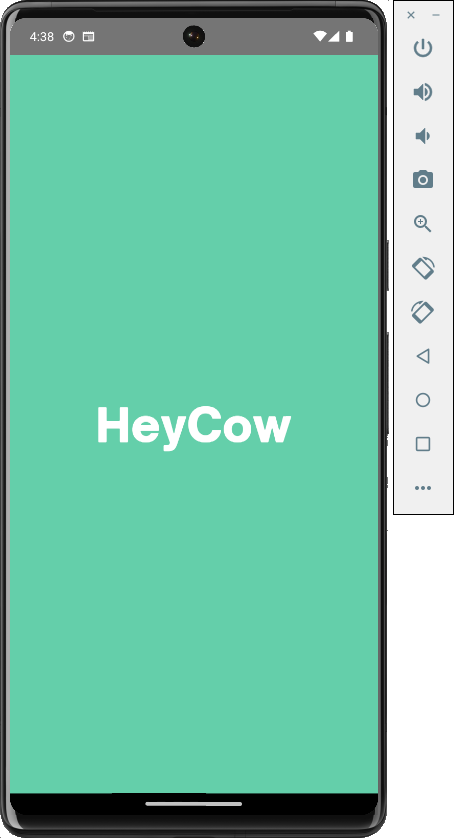
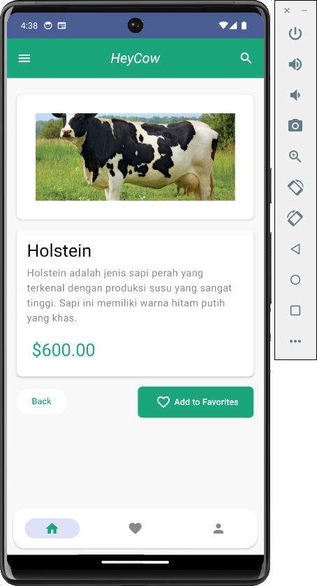
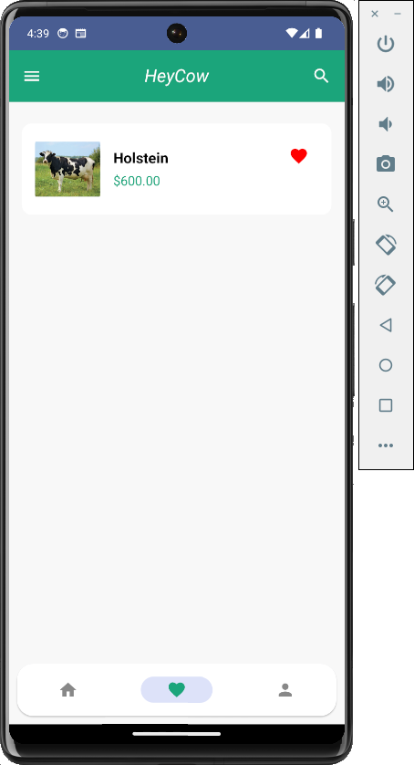

# HeyCow

HeyCow adalah aplikasi yang menampilkan daftar berbagai jenis sapi dengan informasi detail, fitur pencarian, serta kemampuan untuk menambah dan menghapus data. Aplikasi ini juga memiliki halaman "About" yang memuat informasi pribadi dari pengembang. Aplikasi ini dirancang dengan antarmuka yang sederhana namun fungsional, memanfaatkan berbagai komponen modern dalam pengembangan aplikasi.

## Fitur Utama

### 1. Halaman List
- **Menampilkan Daftar Sapi:** Aplikasi menampilkan minimal 10 item sapi dalam format list. List ini diimplementasikan menggunakan `LazyList` atau `LazyGrid`.
- **Navigasi ke Halaman Detail:** Pengguna dapat menekan salah satu item dalam daftar untuk melihat informasi lebih detail tentang sapi tersebut.

### 2. Halaman Detail
- **Informasi Sapi:** Halaman ini menampilkan gambar dan informasi relevan mengenai sapi yang dipilih. Informasi ini mencakup data yang ditampilkan di halaman utama serta beberapa informasi tambahan.
- **Konsistensi Data:** Gambar dan judul di halaman detail sesuai dengan yang ada di halaman list, namun terdapat informasi tambahan yang tidak ditampilkan di list.

### 3. Halaman About
- **Informasi Pengembang:** Halaman ini menampilkan foto diri, nama, dan email yang terdaftar di Dicoding.
- **Navigasi ke Halaman About:** Akses ke halaman ini dapat dilakukan melalui tombol atau elemen View khusus dengan contentDescription “about_page”.

### 4. Fitur Pencarian
- **Pencarian Berdasarkan Kata Kunci:** Pengguna dapat mencari sapi berdasarkan judul. Jika kolom pencarian tidak kosong, aplikasi hanya akan menampilkan data yang sesuai dengan kata kunci yang dimasukkan. Jika kosong, semua data akan ditampilkan.
- **Menggunakan ViewModel:** Fitur pencarian diimplementasikan menggunakan `ViewModel` untuk memisahkan logika favorite dari UI.

### 5. Fitur Menambah & Menghapus Data
- **Tambah & Hapus Data:** Aplikasi memungkinkan pengguna untuk menambah dan menghapus data sapi dalam list utama, favorit, atau keranjang.
- **Penyimpanan Data:** Data disimpan dalam fake List, namun bisa diperluas untuk menggunakan database asli atau API.
- **Notifikasi Data Kosong:** Jika tidak ada data yang tersedia, aplikasi akan menampilkan pesan bahwa data kosong.

### 6. Fitur Favorit (Opsional)
- **Menandai Favorit:** Pengguna dapat menandai sapi sebagai favorit. Data favorit ini dapat ditambah atau dihapus sesuai keinginan pengguna.

## Struktur Aplikasi

- **Bottom Navigation Bar:** Aplikasi ini memiliki `BottomBar` yang memudahkan navigasi antar halaman, termasuk halaman List, Detail, dan About.
- **LazyList/LazyGrid:** Digunakan untuk menampilkan data dalam format list/grid yang efisien.
- **ViewModel:** Digunakan untuk mengelola dan memproses data di dalam aplikasi, termasuk pencarian dan pengelolaan data favorit.

## Cara Menggunakan
1. **Navigasi:** Gunakan bottom bar untuk berpindah antara halaman List, Detail, dan About.
2. **Pencarian:** Gunakan fitur pencarian untuk menemukan sapi berdasarkan nama.
3. **Tambah/Hapus:** Tambahkan sapi ke list favorit atau keranjang, atau hapus dari daftar tersebut sesuai kebutuhan.

## ScreenShoot
<table>
  <tr>
    <td valign="top"></td>
    <td valign="top"></td>
    <td valign="top"></td>
    <td valign="top"></td>
    <td valign="top"></td>
    <td valign="top"></td>
    <td valign="top"></td>
  </tr>
</table>

## Kontak
Untuk informasi lebih lanjut atau pertanyaan, hubungi saya melalui email yang terdaftar di halaman About aplikasi ini.
